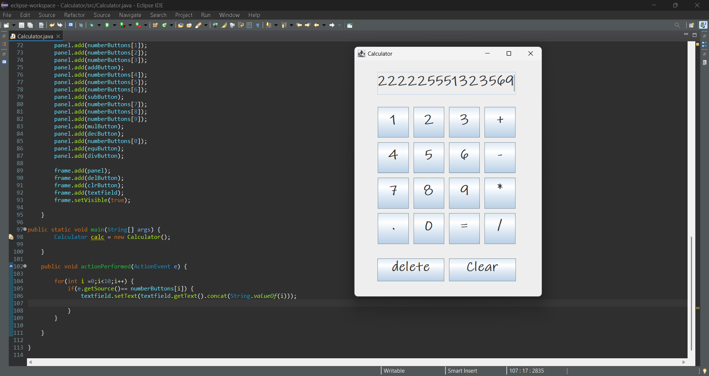

# Java Calculator (Swing)

This is my first Java project built using Swing.

## Features
- Basic arithmetic operations
- GUI using JFrame and GridLayout
- Event handling with ActionListener
- Negative number support
- Clear and delete buttons

## Technologies Used
- Java
- Swing
- AWT

## How to Run
1. Download the project
2. Open in Eclipse / IntelliJ
3. Run Calculator.java

Calculator ScreenShot

## Screenshot

